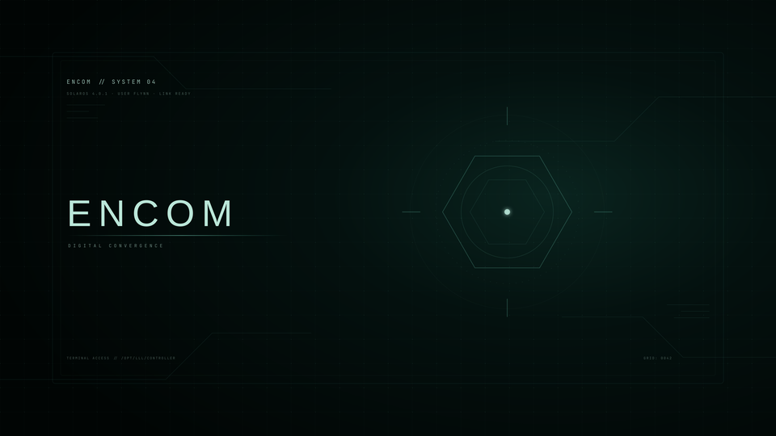

# ENCOM

A cold-phosphor terminal theme for [Omarchy](https://omarchy.org). Green on
smoked glass — Flynn's basement, not a neon arcade.



## Install

```
omarchy theme install https://github.com/leandrolalanne/omarchy-encom-theme
```

Or from the Omarchy menu: **Install → Style → Theme**, then paste the URL.

## Getting the full look

Omarchy strips anything that executes code from a theme installed by URL, and
regenerates it from `colors.toml`. For this theme that means **`hyprland.lua`
is removed**, and with it the window opacity and the disabled blur that make
the desktop read as smoked glass. The colours survive; the glass does not.

Two ways around it, both after installing:

**Copy the Hyprland module in by hand**

```bash
curl -o ~/.config/omarchy/themes/encom/hyprland.lua \
  https://raw.githubusercontent.com/leandrolalanne/omarchy-encom-theme/main/hyprland.lua
omarchy theme set encom
```

**Or install the theme by cloning it yourself**, which Omarchy treats as your
own theme and leaves untouched:

```bash
git clone https://github.com/leandrolalanne/omarchy-encom-theme \
  ~/.config/omarchy/themes/encom
rm -rf ~/.config/omarchy/themes/encom/.git
omarchy theme set encom
```

The `.git` removal is what matters: Omarchy decides whether a theme is yours or
cloned by looking for that directory.

### The hook

`hooks/encom-hyprland-glass` re-applies the same opacity and blur settings
after a theme switch or a reboot. It exists because other themes disable blur
globally when they are active, and whichever hook finishes last wins. Install it
if you run more than one theme that touches Hyprland:

```bash
omarchy hook install theme-set hooks/encom-hyprland-glass
```

It exits immediately unless ENCOM is the current theme.

## Extras

`extras/omarchy-terminal-welcome` replaces Omarchy's terminal greeting with the
SolarOS banner shown in the preview. It is branding, not theming — it prints
only under this theme and exits for every other one.

```bash
cp extras/omarchy-terminal-welcome ~/.local/bin/
chmod +x ~/.local/bin/omarchy-terminal-welcome
```

`~/.local/bin` comes before the packaged binary on `PATH`, so the copy wins.
Delete it to get the stock greeting back.

## What is in here

| File | What it themes |
|---|---|
| `colors.toml` | The palette everything else is generated from |
| `ghostty.conf` | Terminal colours — regenerated from `colors.toml` on a URL install |
| `hyprland.lua` | Window opacity, borders, blur. **Stripped on a URL install** |
| `btop.theme` · `icons.theme` | System monitor, icon set |
| `shell.bar.toml` · `shell.launcher.toml` · `shell.notifications.toml` | Omarchy shell surfaces |
| `gtk-4.0.css` | GTK4 apps, Nautilus included |
| `obsidian.css` | Obsidian |
| `backgrounds/` | Three wallpapers, one of them vector |
| `STYLE.md` | The typography contract the theme follows |

`STYLE.md` describes the wider ENCOM suite, so it mentions surfaces this
repository does not ship.

## Credits

`backgrounds/encom-grid.svg` and the SolarOS banner are original to this theme.
ENCOM is the fictional corporation from *Tron*; this is an unaffiliated fan
theme.

## License

MIT for the theme files — see [LICENSE](LICENSE). Wallpapers that are not
original to this theme keep whatever licence they shipped under.
